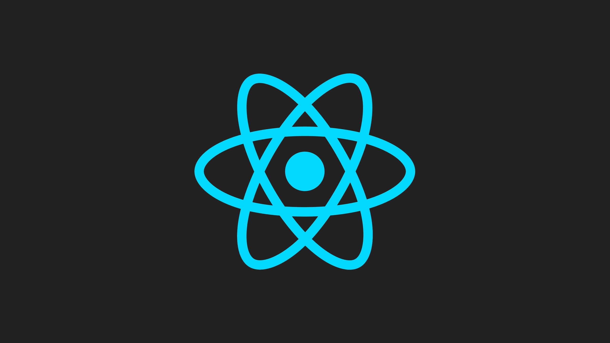
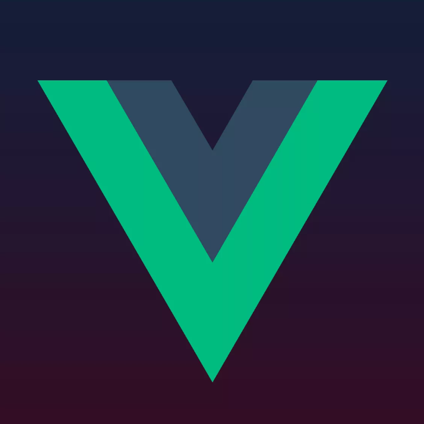

### Currently I pursue the role of the frontend developer. 👋

I'm third year IT student at Russian University Of Transport.  
Language & Framework experience: 
C++ - 8 years, non-commercial, advanced in ML. 
Python - 4 years, half-commercial, freelance, advanced in various API. 
Javascript & HTML & CSS - 2 years, half commercial (was trained upon real projects) 
Django - 1 year, there's experience from both backend and frontend sides 
React - half of the year, 've been doing my coursework on it 
Vue - half of the year, now I'm doing some personal projects on it 

### Languages

  &nbsp;
  &nbsp;

### Frameworks

  &nbsp;
  &nbsp;
  &nbsp;

### Technologies

  &nbsp;
  &nbsp;
  &nbsp;
  &nbsp;
  &nbsp;
  &nbsp;

