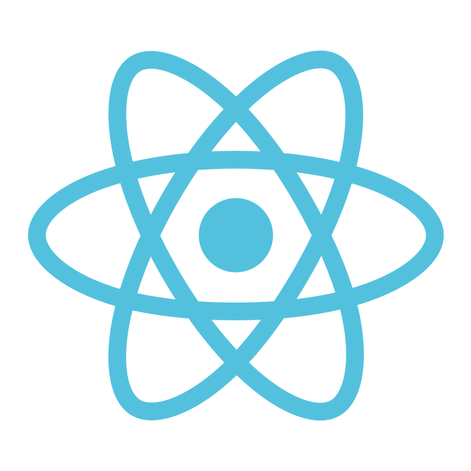
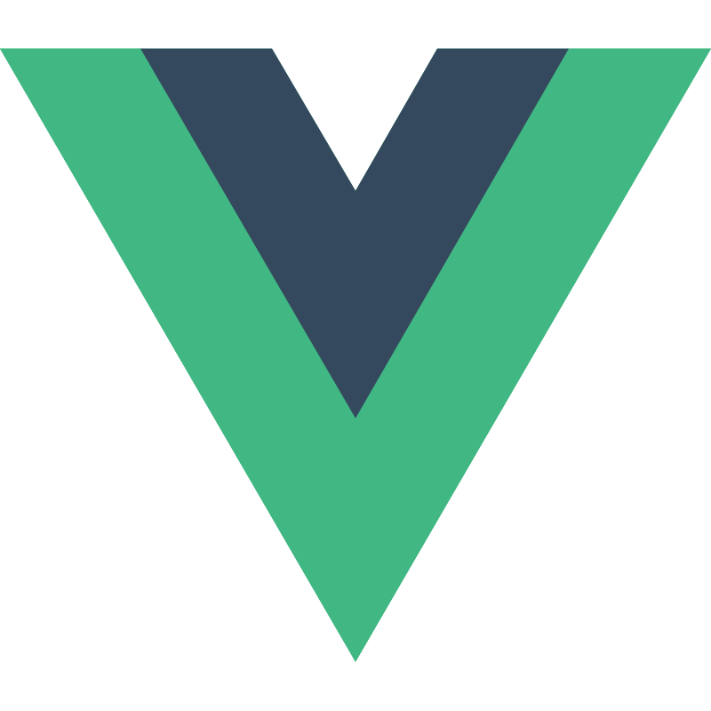
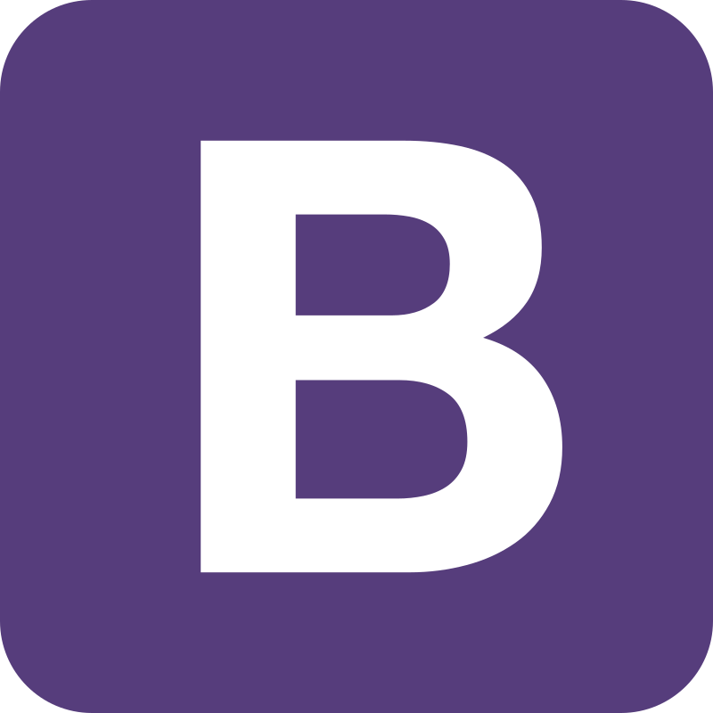
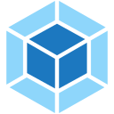
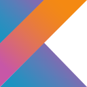
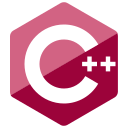

# 🚀 Currently pursuing the role of the frontend developer

> 👨‍🎓 22 y.o, RUT(MIIT), 4th year student  
> 🏢 Frontend Engineer @ Yandex  
> 💼 3 years experience

## 🔥 Stack

<!-- Frontend -->
<table>
  <thead>
    <tr>
      <th align="left"><h3>Frontend</h3></th>
      <th align="center"></th>
      <th align="left"></th>
    </tr>
  </thead>
  <tbody>
    <tr>
      <td><b>Languages</b></td>
      <td>
        
        
        
        
      </td>
      <td>TypeScript  ·  JavaScript  ·  HTML  ·  CSS</td>
    </tr>
    <tr>
      <td><b>Frameworks</b></td>
      <td>
        
        
        
        
      </td>
      <td>React  ·  Vue  ·  Bootstrap  ·  Angular</td>
    </tr>
    <tr>
      <td><b>Loved libraries</b></td>
      <td>
        
        
        
        
        
        
      </td>
      <td>Redux  ·  MobX  ·  Rx.js  ·  Lodash  ·  Webpack  ·  Vite</td>
    </tr>
    <tr>
      <td><b>UI-kits/Design tools</b></td>
      <td>
        
        
        
      </td>
      <td>Figma ·  Ant Design  ·  GravityUI</td>
    </tr>
    <tr>
      <td><b>Testing tools</b></td>
      <td>
        
        
        
        
        <td>Cypress  ·  Playwright   ·  Jest  ·  Karma   ·   Synon   ·  Enzyme</td>
      </td>
    </tr>
    <tr>
      <td><b>Style Tools</b></td>
      <td>
        
        
        
        <td>CSS-modules  ·  SASS  ·  Stylus</td>
      </td>
    </tr>
  </tbody>
</table>

 

<!-- Backend -->
<table>
  <thead>
    <tr>
      <th align="left"><h3>Backend / General</h3></th>
      <th align="center"></th>
      <th align="left"></th>
    </tr>
  </thead>
  <tbody>
    <tr>
      <td><b>Languages</b></td>
      <td>
        
        
        
        
      </td>
      <td>Kotlin  ·  Java  ·  Python  ·  C++</td>
    </tr>
    <tr>
      <td><b>Frameworks</b></td>
      <td>
        
        
        
      </td>
      <td>Express  ·  Django  ·  Spring</td>
    </tr>
    <tr>
      <td><b>Tech</b></td>
      <td>
        
        
      </td>
      <td>Git  ·  Docker</td>
    </tr>
  </tbody>
</table>

## ⚡️ About Me

- Favourite stack: **MERN / MEVN**
- Favourite IDE: **VS Code**

### 🎸 Aside from programming, I enjoy:
- Playing guitar
- Cooking (especially interesting dishes)
- Making cocktails

---

## 🌏 Dream

> ~~Wanna visit Japan this year and make some good memories! 😅~~ visited, that was delightfull!
> Wanna visit China and make some good memories!
> 
